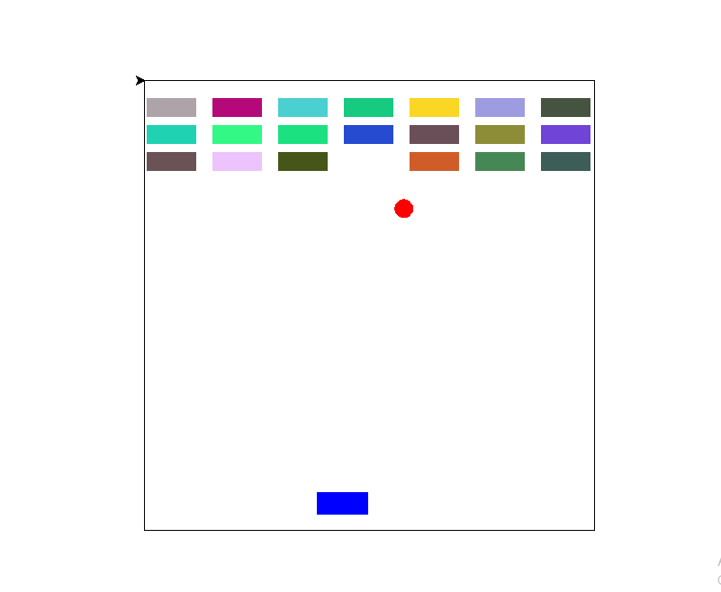

# My first computer game 


This is its code in python:

``` python

import turtle
import random
import time
import math

def makebox():
    for i in range(4):
        turtle.forward(500)
        turtle.right(90)
turtle.tracer(0)
def box():
    b=turtle.Turtle()
    b.shape("square")
    b.shapesize(stretch_len=2.7,stretch_wid=0.9)
    b.penup()

tlx=-220   
tlx2=-220
tlx3=-220 
current_x=tlx
tly1=220
tly2=190
tly3=160
#def boxes():
boxes=[]
for i in range(7):
    p=turtle.Turtle()
    p.penup()
    p.setpos(tlx,tly1)
    tlx +=73
    p.shape("square")
    p.color(random.random(),random.random(),random.random())
    p.shapesize(stretch_len=2.7,stretch_wid=1)
    p.pendown()
    turtle.update()
    boxes.append(p)

for i in range(7):
    p=turtle.Turtle()
    p.penup()
    p.setpos(tlx2,tly2)
    tlx2 +=73
    p.shape("square")
    p.color(random.random(),random.random(),random.random())
    p.shapesize(stretch_len=2.7,stretch_wid=1)
    p.pendown()
    turtle.update()
    boxes.append(p)

for i in range(7):
    p=turtle.Turtle()
    p.penup()
    p.setpos(tlx3,tly3)
    tlx3 +=73
    p.shape("square")
    p.color(random.random(),random.random(),random.random())
    p.shapesize(stretch_len=2.7,stretch_wid=1)
    p.pendown()
    turtle.update() 
    boxes.append(p)       

def makeball():
    ball=turtle.Turtle()
    ball.shape("circle")
    ball.color("red")
    ball.shapesize(1)
    ball.penup()
    ball.setpos(0,-190)
    return ball
def V():
    v=random.randint(100,120)
    alpha=random.randint(40,150)
    vx=v*math.cos(math.radians(alpha))
    vy=v*math.sin(math.radians(alpha))
    return vx , vy
    #list_top.append(p)
dt=0.03
def move(ball:turtle,vx,vy):
    x,y=ball.pos()
    x+=vx*dt
    y+=vy*dt
    ball.setpos(x,y)
def key():
    a=turtle.Turtle()
    a.penup()
    return a


def go_left():
    h=a.heading()
    if h!=-180:
        a.setheading(-180)
    
def go_right():
    h=a.heading()
    if h!=-180:    
        a.setheading(0)
    

turtle.onkey(go_left, "Left")
turtle.onkey(go_right,"Right")


a=turtle.Turtle()
a.color("blue")
a.penup()
a.shape("square")
a.shapesize(stretch_len=2.8,stretch_wid=1.2)
a.penup()
a.setpos(0,-220)
a.setheading(-180)

turtle.penup()
turtle.setpos(-250,250)
turtle.pendown()
makebox()
turtle.listen()

ball=makeball()
vx , vy =V()
while True:
    x,y=a.pos()
    x1,y1=ball.pos()
    x2,y2=p.pos()
    distance1=ball.distance(a)
    for i in range(len(boxes)):
        if  ball.distance(boxes[i])<20:
            boxes[i].penup()
            boxes[i].goto(1000,1000)
            vy=-vy

    move(ball, vx,vy)
    a.forward(5)
    turtle.update()
    time.sleep(0.02)
    if x>210:
        a.setheading(-180)
    if x<-210:
        a.setheading(0)  
    if x1>230:
        x1 = 230
        ball.setx(x1)
        vx = -vx 
    if x1 < -230:
        x1 = -230
        ball.setx(x1)
        vx = -vx    
    if y1>230:
        y1=230
        vy=-vy      
          
    if distance1<30:
        vy=-vy    

    if y1<-250:
        break
            
                


turtle.speed(0)
turtle.mainloop()        


```

